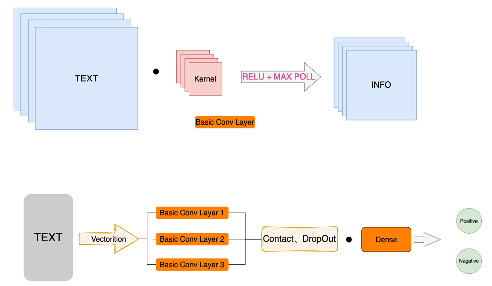
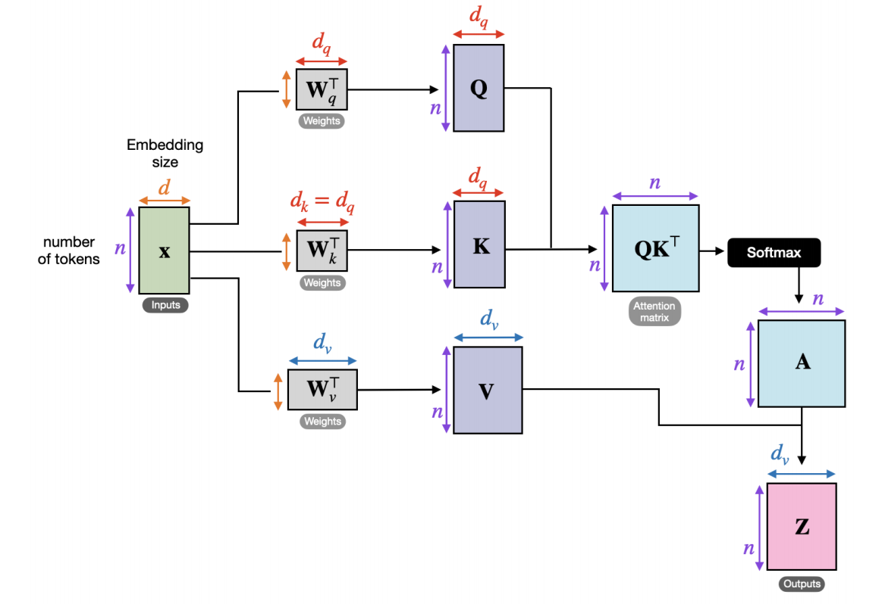
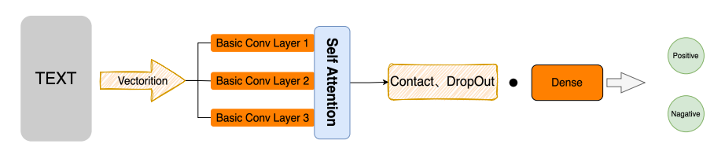

# Text-sentiment-classification
Use a self-attention to improve the original TextCNN and use BERT as a front-end to improve the performance

情感分析是自然语言处理文本分类任务的应用场景之一，情感分类较为简单，实用性也较强。常见的购物网站、电影网站都可以采集到相对高质量的数据集，也很容易给业务领域带来收益。例如，可以结合领域上下文，自动分析特定类型客户对当前产品的意见，可以分主题分用户类型对情感进行分析，以作针对性的处理，甚至基于此进一步推荐产品，提高转化率，带来更高的商业收益。本项目主要基于卷积神经网络对电影评论信息进行情感分析，判断其情感倾向。

## Overview

This repository contains the source code and data for the project, including:

- **Model Implementation**: a self-attention to improve the original TextCNN and use BERT as a front-end to improve the performance
- **Datasets**: Preprocessed datasets used for training and evaluation, designed to test the robustness of text sentiment classification.

## Model Explanation



## Installation

To run this project, clone the repository and install the required dependencies:

```bash
git clone https://github.com/Sjtale/Brain-like-Front-End/.git
cd Brain-like-Front-End
pip install -r requirements.txt
```

## Training and Evaluating

To train the model, use the code in [code/TextCNN_MindSpore.ipynb]:


